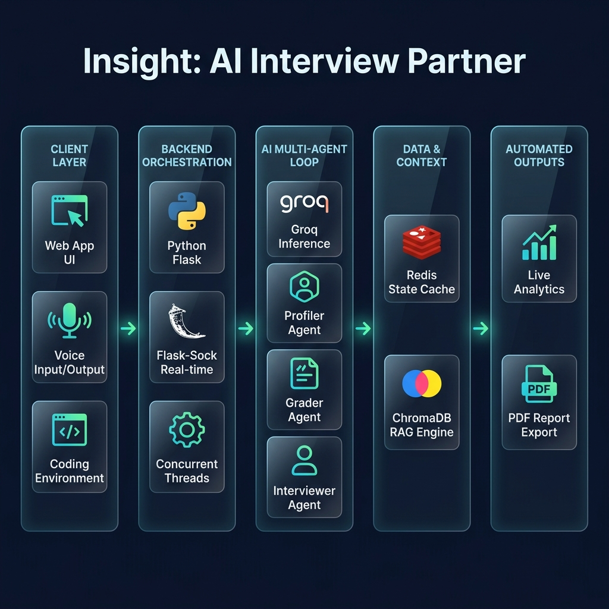

<div align="center">

# 🚀 Insight — AI Interview Practice Partner

**A smart, multi-agent AI system for dynamic, role-based mock interviews.**

[](https://www.python.org)
[](https://flask.palletsprojects.com/)
[](https://opensource.org/licenses/MIT)

</div>



## 📖 Overview

Insight is a sophisticated Flask web application designed for **role-based mock interviews**. It is powered by a **multi-agent LLM loop** (Profiler, Grader, Interviewer, and Feedback agents). Simply upload your resume and paste a job description to practice with adaptive questions, real-time scoring, and receive a comprehensive final feedback report.

## 🛠️ Tech Stack

<div align="center">
  
  
  
  
  
  
  
  
  
  
  
  
  
  
  
  
  
</div>

* **Frontend**: HTML5, CSS3, Vanilla JavaScript, Web Speech API
* **Backend**: Python, Flask, Flask-Sock (WebSockets)
* **AI & Intelligence**: Groq API (LLM Inference)
* **Data & Memory**: Redis (Session Management), ChromaDB (Semantic Retrieval / RAG)

## ✨ Key Features

- 🎭 **Role-Based Interview Flow**: Seamlessly transitions through Technical, Behavioral, and Deep-Dive rounds based on the selected role.
- 📊 **Live Grading & Analytics**: Provides real-time scores, performance trends, and detailed skill breakdowns.
- 💻 **Coding Round UI**: Built-in LeetCode-style environment with a safe Python execution mode for running tests.
- 🗣️ **Voice Input/Output**: Interactive conversational experience utilizing browser Web Speech APIs.
- 📄 **Comprehensive Export**: Download detailed interview transcripts and feedback reports in TXT or PDF formats.

## 🚀 Quickstart

1. **Clone and setup the environment:**

```bash
python -m venv .venv
# Activate on Windows:
.venv\Scripts\activate
# Activate on Mac/Linux:
# source .venv/bin/activate
```

2. **Install dependencies:**

```bash
pip install -r requirements.txt
```

3. **Environment Variables:**
Create a `.env` file in the root directory:

```env
GROQ_API_KEY=your_key_here
```

4. **Run the Application:**

```bash
python app.py
```
Open your browser and navigate to `http://localhost:5000`.

## ⚙️ Configuration (Optional)

You can customize the application behavior using the following environment variables:

| Env Var | Default | Purpose |
|---|---|---|
| `GROQ_API_KEY` | *(required)* | Groq LLM API access |
| `REDIS_URL` | `redis://localhost:6379/0` | Persist session state (falls back to in-memory if Redis is missing) |
| `SESSION_TTL_SECONDS` | `21600` | Redis session time-to-live (6 hours) |
| `CHROMA_DIR` | `./chroma_store` | Path for ChromaDB persistence (RAG capabilities) |

**Notes:**
- Redis, ChromaDB, and PDF export are **optional**. The app falls back gracefully if they aren't installed or available.
- To quickly spin up a local Redis instance using Docker:
  ```bash
  docker run -p 6379:6379 -d redis:7
  ```

## 📂 Repository Layout

- `app.py`: Core Flask server, routing, and real-time WebSocket handlers.
- `agents/`: Contains the AI agent logic (`profiler.py`, `grader.py`, `interviewer.py`, `feedback_generator.py`).
- `templates/`: Contains `index.html` (the single-page application UI).
